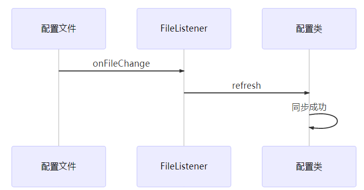

# springsource-refresh
### 一、Introduction
springsource-refresh是用来监听某个目录下配置文件是否有变更，如果配置文件发生变更，就会通知相关配置文件对应的spring配置类刷新内存值，保护与配置文件中的值同步。

### 二、Quick start
#### 1.建立一个工程叫demo,将springsource-refresh引入到工程中

```
<dependency>
    <groupId>com.happygo</groupId>
    <artifactId>springsource-refresh</artifactId>
    <version>0.0.1</version>
</dependency>
```
#### 2.在demo工程中创建一个配置类和一个properties配置文件
##### 2.1.创建配置文件，取名为externalRefresh.properties

```
spring.refresh.now=true
```

##### 2.2.创建配置类，取名叫ExternalRefreshConfig

```
@Configuration
@PropertySource(value = "file:${app.config.path}/externalRefresh.properties")
@RefreshScope(path = "${app.config.path}", file = "externalRefresh.properties")
public class ExternalRefreshConfig implements PropertySourceRefresh {

    /**
     * The constant LOGGER.
     */
    private static final Logger LOGGER = LogManager.getLogger(ExternalRefreshConfig.class);

    /**
     * The constant SPRING_REFRESH_NOW.
     */
    private static final String SPRING_REFRESH_NOW = "spring.refresh.now";

    /**
     * The Now.
     */
    @Value("${spring.refresh.now}")
    private boolean now;

    /**
     * The Environment.
     */
    @Autowired
    private ConfigurableEnvironment environment;

    /**
     * The Resource property source.
     */
    private ResourcePropertySource resourcePropertySource;

    /**
     * Sets .
     */
    @PostConstruct
    public void setup() {
        MutablePropertySources propertySources = environment.getPropertySources();
        String configPath = System.getProperty("app.config.path");
        resourcePropertySource = (ResourcePropertySource) propertySources
                .get("URL [file:" + configPath + "/externalRefresh.properties]");
    }

    /**
     * Is now boolean.
     *
     * @return the boolean
     */
    public boolean isNow() {
        return now;
    }

    /**
     * Refresh.
     */
    @Override
    public void refresh() {
        String configPath = System.getProperty("app.config.path");
        Resource classPathResource = new FileSystemResource(configPath + File.separator + "externalRefresh.properties");
        try {
            Properties properties = PropertiesLoaderUtils.loadProperties(classPathResource);
            if (!ObjectUtils.isEmpty(properties)) {
                resourcePropertySource.getSource().put(SPRING_REFRESH_NOW,
                        properties.getProperty(SPRING_REFRESH_NOW));
                now = Boolean.valueOf(environment.getProperty(SPRING_REFRESH_NOW));
                LOGGER.info("now-->" + now);
            }
        } catch (IOException e) {
            LOGGER.info("刷新配置文件externalRefresh.properties失败");
        }
    }
}
```
> app.config.path为VM Options选项或者其他配置文件中的属性值

#### 3.配置文件上下文监听器使用
##### 3.1.Java API方式

```
@Bean
public ContextFileListener fileListener(ConfigurableEnvironment environment) {
    ContextFileListener listener = new ContextFileListener();
    FileMonitor fileMonitor = new FileMonitor(10, TimeUnit.SECONDS);
    listener.setFileMonitor(fileMonitor);
    return listener;
}
```
##### 3.2.xml方式

```
<bean id="fileListenr" class="com.happygo.springrefresh.ContextFileListener">
    <property name="fileMonitor">
        <bean id="fileMonitor" class="com.happygo.springrefresh.FileMonitor">
            <constructor-arg index="0" value="10"/>
            <constructor-arg index="1" value="SECONDS"/>
        </bean>
    </property>
</bean>
```
### 三、SpringSource Refresh Timing Diagram 

